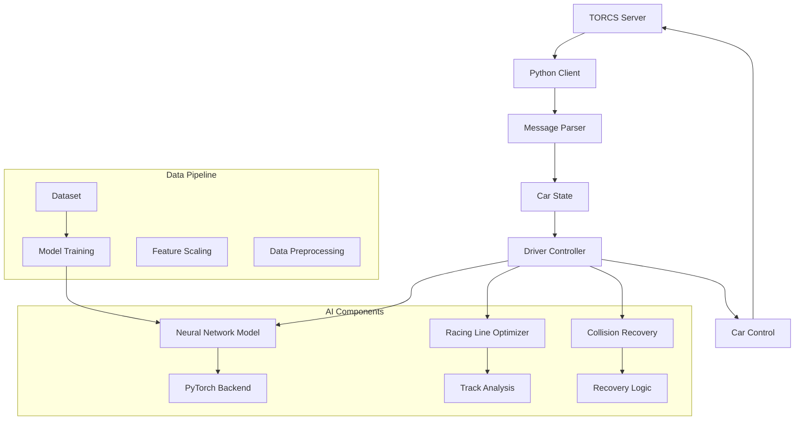

# �️ TORCS AI Racing Controller
**Deep Learning-Powered Autonomous Racing System**

[](https://www.python.org/)
[](https://pytorch.org/)
[](http://torcs.sourceforge.net/)
[](https://numpy.org/)
[](https://scipy.org/)

---

## 📖 Table of Contents
- [🎯 Overview](#-overview)
- [✨ Features](#-features)
- [🏗️ Architecture](#-architecture)
- [🚀 Quick Start](#-quick-start)
- [📁 Project Structure](#-project-structure)
- [🔧 Configuration](#-configuration)
- [🛠️ Development](#-development)
- [📊 Analytics](#-analytics)
- [🚀 Deployment](#-deployment)
- [🔍 API Documentation](#-api-documentation)
- [🤝 Contributing](#-contributing)
- [📄 License](#-license)

---

## 🎯 Overview

The TORCS AI Racing Controller is an intelligent autonomous racing system that uses deep learning and advanced racing algorithms to compete in the TORCS (The Open Racing Car Simulator) environment. Built for the AI 2002 course project, this controller combines neural network-based decision making with sophisticated racing line optimization and collision recovery strategies.

### 🎯 Problem We Solve

- **Manual racing strategies** are time-consuming and ineffective for dynamic tracks
- **Real-time decision making** under high-speed racing conditions
- **Unknown track navigation** without prior knowledge or training data
- **Collision recovery** and stuck scenario handling
- **Optimal racing line calculation** for maximum performance

### 💡 Our Solution

An intelligent racing system that provides:

- **Deep neural network** for real-time steering, acceleration, and braking decisions
- **Advanced racing line optimization** using mathematical models and sensor fusion
- **Intelligent collision recovery** with multi-phase stuck detection and recovery
- **Real-time telemetry processing** from 19 track sensors and car state data
- **Adaptive racing strategies** for different track conditions and racing modes

---

## ✨ Features

### 🤖 Deep Learning Controller

- **5-layer neural network** with batch normalization and dropout
- **30+ input features** including track sensors, speed, position, and race data
- **PyTorch JIT compilation** for optimized inference performance
- **Feature caching and normalization** for consistent predictions
- **Model optimization** with advanced inference techniques

### 🛤️ Racing Line Optimization

- **Mathematical racing line calculation** using "out-in-out" cornering principles
- **Dynamic curvature estimation** from sensor data using Gaussian filtering
- **Track segment classification** (straights, left turns, right turns, chicanes)
- **Optimal positioning algorithms** for apex hitting and corner exit optimization
- **Speed profile management** based on track geometry

### 🚗 Intelligent Collision Recovery

- **Multi-phase stuck detection** using speed, angle, and proximity metrics
- **Smart reverse logic** with directional steering for efficient recovery
- **Recovery path planning** with progress tracking and attempt limiting
- **Cooldown mechanisms** to prevent recovery loops
- **Emergency maneuvers** for critical situations

### 🏎️ Adaptive Racing Strategies

- **Multiple driving modes**: Aggressive, Balanced, and Safe
- **Dynamic speed management** based on track conditions
- **Gear optimization** for maximum performance
- **Contextual decision making** based on race position and track state
- **Performance monitoring** and real-time adjustments

### 📡 Advanced Telemetry Processing

- **19 rangefinder sensors** for track boundary detection
- **Car state monitoring** (speed, position, damage, fuel, RPM)
- **Race information processing** (lap time, position, distance)
- **Sensor calibration and error handling** for robust operation
- **Real-time feature extraction** and normalization

---

## 🏗️ Architecture



### 🧩 Technology Stack

| **Category** | **Technology** | **Purpose** |
|-------------|---------------|-------------|
| **Core Language** | Python 3.8+ | Main programming language |
| **Deep Learning** | PyTorch 2.0+ | Neural network implementation |
| **Scientific Computing** | NumPy, SciPy | Mathematical operations and signal processing |
| **Data Processing** | Pandas | Dataset analysis and preprocessing |
| **Model Persistence** | Joblib | Model and scaler serialization |
| **Visualization** | Matplotlib | Training history and performance plotting |
| **Racing Simulator** | TORCS 1.3.4 | Racing environment and physics |
| **Progress Tracking** | tqdm | Training progress monitoring |

---

## 🚀 Quick Start

### 📋 Prerequisites

- **TORCS 1.3.4** with competition server patch
- **Python 3.8+** with pip package manager
- **Git** for version control
- **Operating System**: Linux or Windows (macOS not officially supported)

### ⚡ Installation

1. **Clone the repository**
   ```bash
   git clone https://github.com/Huzaifanasir95/TORCS-AI-Racing-Controller.git
   cd TORCS-AI-Racing-Controller
   ```

2. **Install Python dependencies**
   ```bash
   pip install -r requirements.txt
   ```

3. **Install and configure TORCS**
   
   **For Linux:**
   ```bash
   # Download TORCS 1.3.4 from SourceForge
   tar xfvj torcs-1.3.4.tar.bz2
   cd torcs-1.3.4
   tar xfvz scr-linux-patch.tgz
   cd scr-patch
   sh do-patch.sh
   cd ..
   ./configure && make && make install && make datainstall
   ```
   
   **For Windows:**
   - Install TORCS 1.3.4 from the official website
   - Unzip `scr-win-patch.zip` into the TORCS directory

4. **Configure TORCS for competition**
   ```bash
   # Launch TORCS
   torcs
   # Navigate to: Race > Quick Race > Configure Race
   # Add 'scr_server' bot to participants
   # Save configuration
   ```

5. **Start TORCS server**
   ```bash
   torcs -nofuel -nodamage -nolaptime
   ```

6. **Run the AI controller**
   ```bash
   python pyclient.py --host localhost --port 3001 --id SCR
   ```

### 🔧 Optional: Model Training

If you have training data available:

```bash
# Analyze your dataset
python analyze_dataset.py

# Train a new model
python train_racing_model.py

# Check dataset quality
python check_dataset.py
```

---

## 📁 Project Structure

```
TORCS-AI-Racing-Controller/
│
├── 📄 pyclient.py              # Main client entry point
├── 📄 driver.py                # Core AI driver logic
├── 📄 carState.py              # Car state representation
├── 📄 carControl.py            # Control command interface
├── 📄 msgParser.py             # TORCS message parser
├── 📄 racing_line_optimizer.py # Racing line algorithms (placeholder)
│
├── 🤖 Model & Training Files
│   ├── train_racing_model.py   # Neural network training script
│   ├── best_racing_model.pth   # Pre-trained model weights
│   ├── racing_model.pth        # Alternative model weights
│   └── scaler.pkl              # Feature scaler for normalization
│
├── 📊 Data Analysis
│   ├── analyze_dataset.py      # Dataset analysis tools
│   ├── check_dataset.py        # Data quality validation
│   └── training_history.png    # Training visualization
│
├── 📋 Configuration
│   ├── requirements.txt        # Python dependencies
│   └── README.md              # This documentation
│
└── 📁 .git/                   # Git version control
```

---

## 🔧 Configuration

### 🌍 Command Line Arguments

| **Parameter** | **Description** | **Default** | **Example** |
|-------------|----------------|-------------|-------------|
| `--host` | TORCS server hostname | `localhost` | `--host 192.168.1.100` |
| `--port` | TORCS server port | `3001` | `--port 3001` |
| `--id` | Bot identifier | `SCR` | `--id MyBot` |
| `--maxEpisodes` | Maximum learning episodes | `1` | `--maxEpisodes 10` |
| `--maxSteps` | Maximum steps per episode | `0` (unlimited) | `--maxSteps 1000` |
| `--track` | Specific track name | `None` | `--track aalborg` |
| `--stage` | Competition stage | `3` (unknown) | `--stage 2` |

### 🏁 Competition Stages

| **Stage** | **Name** | **Description** |
|-----------|----------|----------------|
| `0` | Warm-Up | Practice session |
| `1` | Qualifying | Time trial for grid position |
| `2` | Race | Competitive racing |
| `3` | Unknown | General/testing mode |

### 🎛️ Model Configuration

The neural network can be configured by modifying constants in `driver.py`:

```python
MODEL_CACHE_SIZE = 5          # Prediction cache size
FEATURE_HASH_PRECISION = 3    # Feature hashing precision
INFERENCE_BATCH_SIZE = 4      # Batch size for inference
MODEL_OPTIMIZATION_LEVEL = 2  # Optimization level (0-2)
```

---

## 🛠️ Development

### 📝 Available Scripts

```bash
# Run the AI controller
python pyclient.py --host localhost --port 3001 --id SCR

# Analyze training dataset
python analyze_dataset.py

# Train a new neural network model
python train_racing_model.py

# Validate dataset quality
python check_dataset.py

# Install dependencies
pip install -r requirements.txt
```

### 🏗️ Development Workflow

1. **Feature Development**
   ```bash
   git checkout -b feature/your-feature-name
   # Make your changes
   # Test with TORCS
   git commit -m "feat: add your feature"
   git push origin feature/your-feature-name
   ```

2. **Model Training**
   ```bash
   # Prepare your training data in data/Dataset.csv
   python analyze_dataset.py
   python train_racing_model.py
   # Test new model
   python pyclient.py
   ```

3. **Testing and Validation**
   - Start TORCS server: `torcs -nofuel -nodamage -nolaptime`
   - Run controller with different tracks and conditions
   - Monitor performance metrics and lap times
   - Validate stuck recovery and collision handling

### 🔍 Debugging and Monitoring

1. **Performance Monitoring**
   ```python
   # In driver.py, check these metrics:
   - self.model_inference_time      # Model prediction time
   - self.cache_hit_count          # Cache efficiency
   - self.stuck_timer              # Stuck detection
   - self.racing_line_offset       # Track position optimization
   ```

2. **Telemetry Analysis**
   ```python
   # Monitor sensor data quality:
   - Track sensor readings (19 values)
   - Speed components (X, Y, Z)
   - Car angle and track position
   - Damage and fuel levels
   ```

3. **Model Validation**
   ```bash
   # Check model performance:
   python check_dataset.py
   # Verify feature scaling:
   import joblib; scaler = joblib.load('scaler.pkl')
   ```

---

## 📊 Analytics

### 📈 Performance Metrics

- **Lap Time**: Complete lap duration and consistency
- **Average Speed**: Mean velocity throughout the race
- **Track Position Accuracy**: Deviation from optimal racing line
- **Collision Rate**: Frequency of off-track incidents
- **Recovery Efficiency**: Time to recover from stuck situations
- **Model Inference Time**: Neural network prediction latency

### 📋 Training Metrics

- **Loss Convergence**: Training and validation loss over epochs
- **Feature Importance**: Impact of different input features
- **Prediction Accuracy**: Model output quality assessment
- **Overfitting Detection**: Training vs validation performance

### 📊 Real-time Monitoring

The controller provides real-time analytics during operation:

```python
# Performance tracking in driver.py
- Cache hit ratio: cache_hits / (cache_hits + cache_misses)
- Inference time: model_inference_time / model_inference_count
- Stuck recovery success rate: successful_recoveries / total_attempts
- Racing line adherence: average(abs(racing_line_offset))
```

---

## 🚀 Deployment

### 🖥️ Local Deployment

1. **Start TORCS Server**
   ```bash
   torcs -nofuel -nodamage -nolaptime
   ```

2. **Configure Race Settings**
   - Select "Quick Race" or "Practice"
   - Add `scr_server` to participants
   - Choose track and race duration

3. **Launch AI Controller**
   ```bash
   python pyclient.py --host localhost --port 3001 --id SCR
   ```

### 🌐 Remote Deployment

For remote TORCS servers:

```bash
python pyclient.py --host <server-ip> --port <server-port> --id <unique-id>
```

### 🔄 Competition Mode

For TORCS competition scenarios:

```bash
# Qualifying session
python pyclient.py --stage 1 --maxEpisodes 1

# Race session
python pyclient.py --stage 2 --maxSteps 10000

# Practice session
python pyclient.py --stage 0 --track aalborg
```

---

## 🔍 API Documentation

### 📡 Core Classes

#### Driver Class
```python
class Driver:
    def __init__(self, stage, model_path='best_racing_model.pth', scaler_path='scaler.pkl')
    def drive(self, msg)                    # Main driving logic
    def init(self)                          # Initialize connection
    def onRestart(self)                     # Handle race restart
    def onShutDown(self)                    # Clean shutdown
```

#### Neural Network Model
```python
class RacingModel(nn.Module):
    def __init__(self, input_size, output_size)
    def forward(self, x)                    # Forward pass
    def optimize(self)                      # Model optimization
```

#### Car State Management
```python
class CarState:
    def setFromMsg(self, str_sensors)       # Parse sensor data
    def toMsg(self)                         # Serialize state
    # Properties: angle, speed, track, damage, fuel, etc.
```

### 📝 Message Protocol

The controller communicates with TORCS using a string-based protocol:

**Input Message Format:**
```
(angle 0.1)(curLapTime 45.2)(damage 0)(distFromStart 100)...
```

**Output Message Format:**
```
(accel 0.8)(brake 0.0)(gear 4)(steer 0.1)(clutch 0.0)...
```

### 🔧 Feature Vector

The neural network processes 27 input features:

| **Category** | **Features** | **Description** |
|-------------|-------------|----------------|
| **Track Sensors** | `track_0` to `track_18` | 19 rangefinder readings |
| **Speed** | `speedX`, `speedY`, `speedZ` | Velocity components |
| **Position** | `angle`, `trackPos` | Car orientation and track position |
| **Car State** | `damage`, `fuel`, `gear`, `rpm` | Vehicle status |
| **Race Info** | `racePos`, `lapTime`, `distFromStart` | Competition data |

---

## 🤝 Contributing

### 🌟 How to Contribute

1. **Fork the repository**
2. **Create a feature branch**
   ```bash
   git checkout -b feature/amazing-feature
   ```
3. **Make your changes**
   - Add new algorithms or optimizations
   - Improve model architecture
   - Enhance racing strategies
   - Fix bugs or performance issues
4. **Test thoroughly**
   ```bash
   # Test with different tracks and conditions
   python pyclient.py --track aalborg
   python pyclient.py --track forza
   ```
5. **Commit your changes**
   ```bash
   git commit -m 'feat: add amazing feature'
   ```
6. **Push and create Pull Request**
   ```bash
   git push origin feature/amazing-feature
   ```

### 📋 Contribution Guidelines

- Follow PEP 8 Python style guidelines
- Add docstrings to new functions and classes
- Test changes with multiple TORCS tracks
- Update documentation for new features
- Ensure backward compatibility with existing models
- Include performance benchmarks for optimizations

### 🐛 Bug Reports

Please use GitHub issues to report bugs, including:

- **Description**: Clear explanation of the issue
- **Steps to reproduce**: Detailed reproduction steps
- **Expected vs actual behavior**: What should happen vs what happens
- **Environment**: OS, Python version, TORCS version, track name
- **Error logs**: Console output and error messages

### 💡 Feature Requests

We welcome enhancement requests for:

- **New racing algorithms**: Advanced cornering, overtaking strategies
- **Model improvements**: Architecture changes, training optimizations
- **Performance enhancements**: Faster inference, better caching
- **Analysis tools**: Data visualization, performance metrics
- **Track-specific optimizations**: Specialized strategies for different circuits

---

## 📄 License

This project is licensed under the MIT License - see the [LICENSE](LICENSE) file for details.

---

## 📞 Support

- **GitHub Issues**: [Report bugs or request features](https://github.com/Huzaifanasir95/TORCS-AI-Racing-Controller/issues)
- **TORCS Documentation**: [Official TORCS Website](http://torcs.sourceforge.net/)
- **PyTorch Resources**: [PyTorch Documentation](https://pytorch.org/docs/)
- **Competition Manual**: Check TORCS competition documentation for race rules

---

## 🙏 Acknowledgments

- **TORCS Development Team** for the excellent racing simulator
- **PyTorch Team** for the powerful deep learning framework
- **SciPy Community** for scientific computing tools
- **AI 2002 Course** for project inspiration and guidance
- **Open Source Community** for continuous improvements and feedback

---

*🏁 Empowering autonomous racing through deep learning and intelligent control systems*
